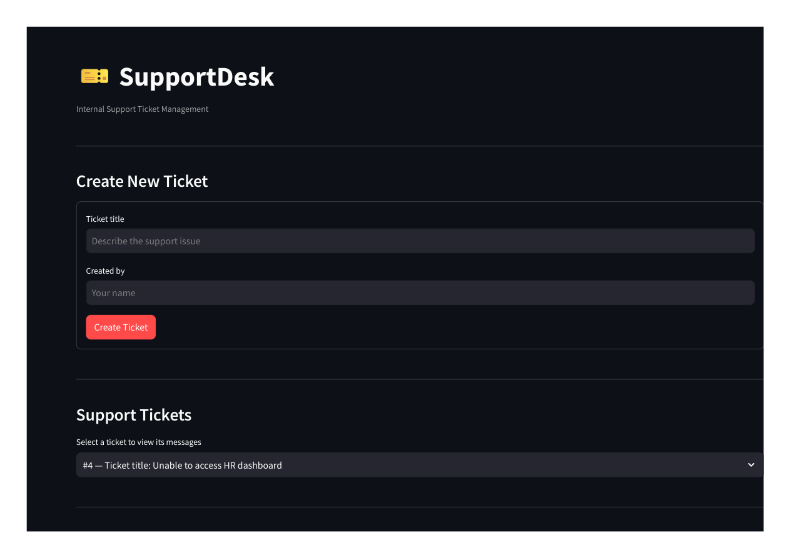
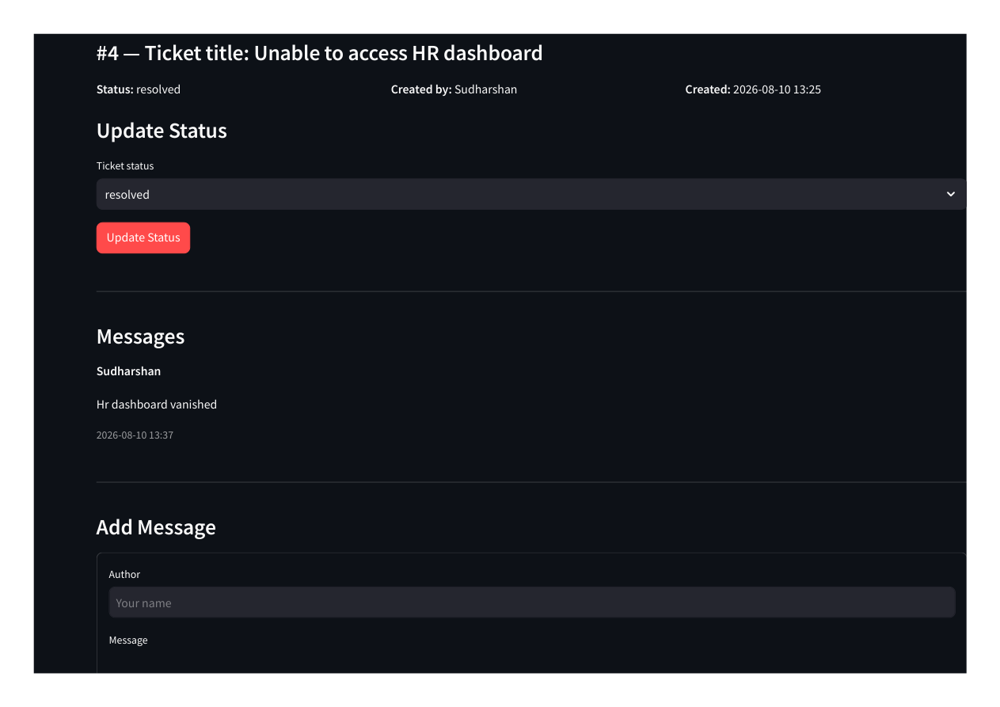
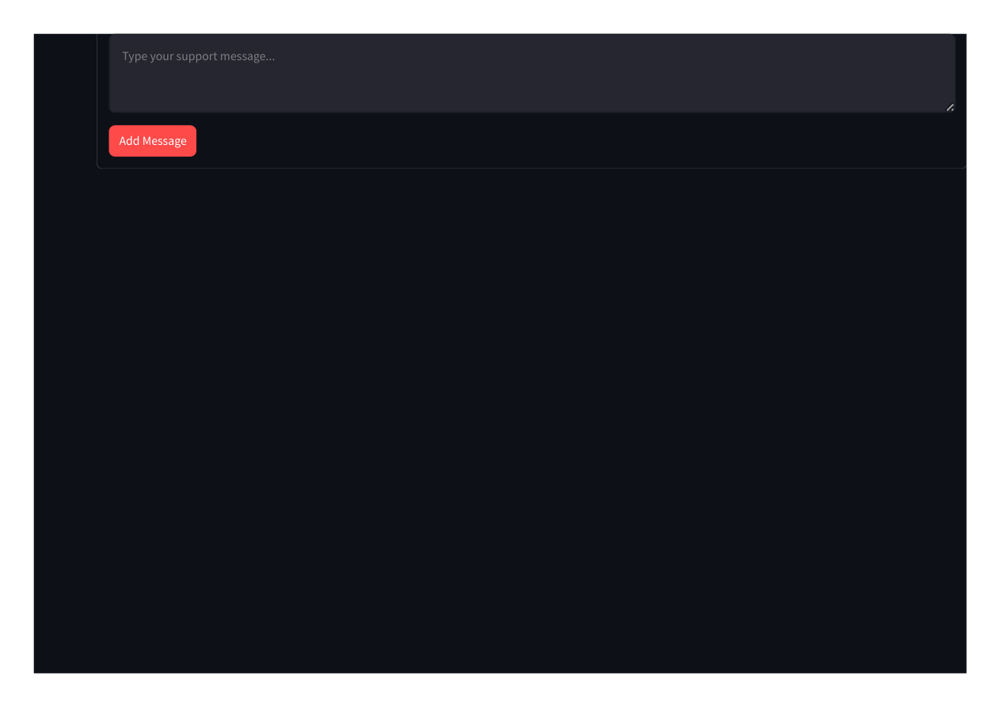
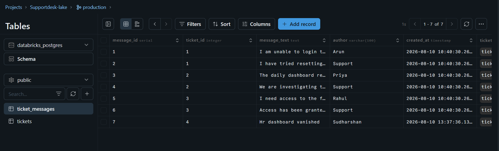
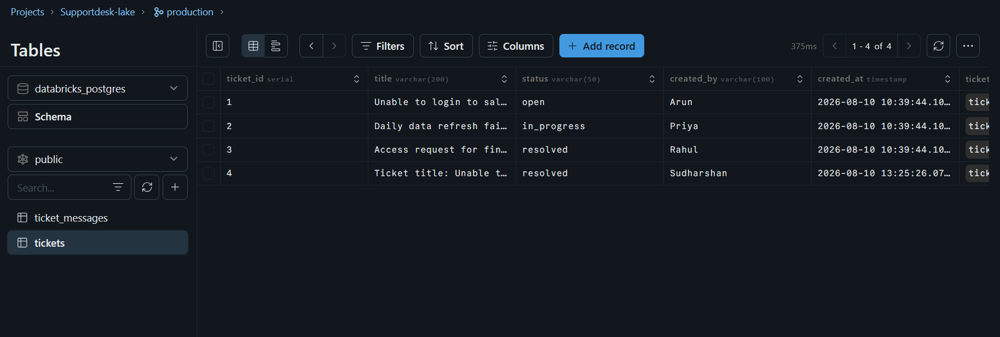

# 🎫 DE-001 - SupportDesk — Lakebase-Powered Support Ticket Management

A transactional support ticket management application built using **Databricks Apps, Streamlit, and Lakebase PostgreSQL**.

The application allows internal teams to create support tickets, view existing tickets, read ticket conversations, add messages, update ticket status, and prioritize support requests.

---

## 📌 Business Problem

Internal support teams need a simple system to manage employee support requests.

Without a centralized support system, requests can become difficult to track:

- What issues are currently open?
- Which employee created the request?
- What conversations have happened?
- What is the current status of each ticket?
- Which tickets should be handled first?

This project solves the problem by providing a lightweight transactional support ticket application backed by **Databricks Lakebase PostgreSQL**.

---

## 🎯 Project Objectives

The application provides the following capabilities:

1. View all support tickets
2. Select a ticket and view its messages
3. Create a new support ticket
4. Add messages to an existing ticket
5. Update ticket status
6. Set ticket priority
7. Update ticket priority
8. Persist all changes in Lakebase
9. Deploy the application using Databricks Apps

---

## 🏗️ Architecture

    User
      │
      ▼
    Databricks Apps
      │
      │ Streamlit
      ▼
    Application Logic
      │
      │ psycopg
      ▼
    Lakebase PostgreSQL
      │
      ├───────────────┐
      ▼               ▼
    tickets      ticket_messages

---

## 🗄️ Data Model

SupportDesk uses two related transactional tables.

    ┌─────────────────────────────────────┐
    │              tickets                │
    ├─────────────────────────────────────┤
    │ PK  ticket_id      SERIAL           │
    │     title          VARCHAR(200)     │
    │     status         VARCHAR(50)      │
    │     priority       VARCHAR(20)      │
    │     created_by     VARCHAR(100)     │
    │     created_at     TIMESTAMP        │
    └──────────────────┬──────────────────┘
                       │
                       │ 1 : Many
                       ▼
    ┌─────────────────────────────────────┐
    │          ticket_messages            │
    ├─────────────────────────────────────┤
    │ PK  message_id     SERIAL           │
    │ FK  ticket_id      INTEGER          │
    │     message_text   TEXT             │
    │     author         VARCHAR(100)     │
    │     created_at     TIMESTAMP        │
    └─────────────────────────────────────┘

### Table Responsibilities

| Table | Responsibility |
|---|---|
| `tickets` | Stores ticket information, status, and priority |
| `ticket_messages` | Stores conversations associated with each ticket |

A single support ticket can contain multiple messages.

---

## ⚙️ Application Features

### 1. View Support Tickets

Users can view:

- Ticket ID
- Title
- Status
- Priority
- Creator
- Creation timestamp

### 2. Select a Ticket and View Messages

Users can select a ticket and view its associated conversation history.

### 3. Create a Ticket

Users can create a ticket using:

- Ticket title
- Priority
- Created by

Supported priorities:

    low
    medium
    high
    critical

New tickets start with:

    open

The `created_at` timestamp is generated automatically by the database.

### 4. Add a Message

Users can add messages to an existing ticket.

Each message is associated with the selected ticket using `ticket_id`.

### 5. Update Ticket Status

Supported statuses:

    open
    in_progress
    resolved

The updated status is persisted in Lakebase.

### 6. Ticket Priority

Not every support issue has the same urgency.

The application allows support teams to assign:

    low
    medium
    high
    critical

Priority is stored directly in the `tickets` table and can be updated for existing tickets.

Example:

    High
      ↓
    Critical
      ↓
    Persisted in Lakebase

The priority feature was tested on the deployed Databricks application and verified after refreshing the application.

---

## 🔄 Application Flow

    Create Ticket
          │
          ▼
       Lakebase
          │
          ▼
     View Ticket
          │
          ├──────────────► View Messages
          │                     │
          │                     ▼
          │                Add Message
          │                     │
          │                     ▼
          │                  Lakebase
          │
          ├──────────────► Update Status
          │                     │
          │                     ▼
          │                  Lakebase
          │
          └──────────────► Update Priority
                                │
                                ▼
                             Lakebase

---

## 🔐 Database Connectivity

The application uses:

- Python
- `databricks-sdk`
- `psycopg`
- `psycopg-pool`
- OAuth-based database credentials
- Databricks App resource authorization

The application dynamically generates database credentials using the Databricks SDK.

Database passwords are not hard-coded into the application.

Connection flow:

    Databricks App
          │
          ▼
    Databricks SDK
          │
          ▼
    Generate database credential
          │
          ▼
    psycopg / ConnectionPool
          │
          ▼
    Lakebase PostgreSQL

---

## 🔑 Database Permissions

The Databricks App connects to Lakebase using its service principal.

The application uses the `public` schema containing:

    public
    ├── tickets
    └── ticket_messages

Required PostgreSQL operations include:

- SELECT
- INSERT
- UPDATE
- DELETE

Sequence permissions were also configured to support automatically generated IDs.

---

## 📁 Project Structure

    supportdesk-lakebase/
    │
    ├── business/
    │
    ├── sql/
    │
    ├── app/
    │   ├── app.py
    │   ├── app.yaml
    │   ├── manifest.yaml
    │   └── requirements.txt
    │
    ├── screenshots/
    │   ├── deployed_application_page_1.png
    │   ├── deployed_application_page_2.png
    │   ├── deployed_application_page_3.png
    │   ├── lakebase_ticket_messages.png
    │   └── lakebase_tickets.png
    │
    └── README.md

---

## 🛠️ Technology Stack

| Technology | Purpose |
|---|---|
| Python | Application development |
| Streamlit | Web application UI |
| Databricks Apps | Application deployment |
| Lakebase | Transactional PostgreSQL database |
| PostgreSQL | Relational data storage |
| psycopg | PostgreSQL connectivity |
| psycopg-pool | Database connection pooling |
| Databricks SDK | Databricks integration |
| SQL | Data modeling and database operations |
| Databricks CLI | Source synchronization and deployment |

---

## 🚀 Deployment

The application is deployed using **Databricks Apps**.

Application source:

    app.py
    app.yaml
    manifest.yaml
    requirements.txt

Authenticate with Databricks CLI:

    databricks auth login

Synchronize the application source:

    databricks sync app "<WORKSPACE_SOURCE_PATH>"

Deploy the application:

    databricks apps deploy supportdesk-app --source-code-path "<WORKSPACE_SOURCE_PATH>"

---

## 🧪 Testing

The application was tested through the deployed Databricks App against the actual Lakebase PostgreSQL database.

### Ticket Creation

A new ticket can be created through the Streamlit interface and remains available after refreshing the application.

### Ticket Selection

Users can select an existing ticket and view its associated messages.

### Message Creation

A new message can be added to an existing ticket and remains persisted after refreshing.

### Status Update

Ticket status can be changed between:

    open
    in_progress
    resolved

The updated status remains persisted after refreshing the application.

### Priority Update

Ticket priority can be changed between:

    low
    medium
    high
    critical

The priority feature was tested end-to-end:

    High
      ↓
    Critical
      ↓
    Refresh application
      ↓
    Critical

The updated priority was also verified in Lakebase.

---

## 📊 Current Database State

The final test database contains:

    tickets          → 4 records
    ticket_messages  → 7 records

The database contains both original sample records and records created or modified through the deployed application.

This demonstrates that the application performs real database operations rather than displaying hard-coded data.

---

## 🔄 CRUD Operations

### Create Ticket

    INSERT INTO public.tickets
        (title, status, priority, created_by)
    VALUES
        (%s, %s, %s, %s);

### Create Message

    INSERT INTO public.ticket_messages
        (ticket_id, message_text, author)
    VALUES
        (%s, %s, %s);

### Read Tickets

    SELECT
        ticket_id,
        title,
        status,
        priority,
        created_by,
        created_at
    FROM public.tickets
    ORDER BY created_at DESC;

### Read Messages

    SELECT
        message_id,
        message_text,
        author,
        created_at
    FROM public.ticket_messages
    WHERE ticket_id = %s
    ORDER BY created_at ASC;

### Update Status

    UPDATE public.tickets
    SET status = %s
    WHERE ticket_id = %s;

### Update Priority

    UPDATE public.tickets
    SET priority = %s
    WHERE ticket_id = %s;

The current MVP does not expose ticket deletion through the UI.

---

## 🧠 Why Lakebase?

The support application requires **transactional operational data**.

Users continuously perform operations such as:

    Create Ticket
    Add Message
    Update Status
    Update Priority
    Read Ticket
    Read Conversation

These operations require:

- Fast reads and writes
- Row-level updates
- Relational integrity
- Primary keys
- Foreign keys
- Transaction support
- Persistent operational state

Lakebase provides a PostgreSQL-compatible operational database suited for this workload.

This differs from storing the same data primarily in a traditional analytical table designed for reporting and large-scale analytical queries.

---

## 📈 Potential Analytics Layer

The transactional data can later become the source for an analytical layer.

Potential KPIs include:

- Total support tickets
- Open tickets
- In-progress tickets
- Resolved tickets
- Tickets by status
- Tickets by priority
- Tickets by creator
- Average resolution time
- Messages per ticket
- Tickets created per day
- High-priority ticket backlog
- Critical ticket backlog

Future architecture:

    Lakebase
       │
       ▼
    Data Engineering
       │
       ├──────────────┐
       ▼              ▼
    Spark          SQL / ETL
       │              │
       └──────┬───────┘
              ▼
       Analytical Layer
              │
              ▼
         BI Dashboard

This would extend the project from a transactional application into a complete Data Engineering pipeline.

---

## 🔮 Future Improvements

Possible future enhancements:

- Ticket categories
- Ticket assignment
- Search and filtering
- Pagination
- SLA tracking
- User authentication
- Role-based access
- Audit logging
- Email notifications
- Automated escalation
- Support KPI dashboard
- Historical ticket analytics
- Spark-based data pipeline
- Databricks SQL dashboard
- Power BI integration

---

## 🎓 Key Learnings

This project provided hands-on experience in building a transactional application around a PostgreSQL-compatible database within the Databricks ecosystem.

Key learnings include:

- Databricks Apps
- Lakebase
- PostgreSQL
- Databricks CLI
- SQL
- Relational data modeling
- Primary keys
- Foreign keys
- Database permissions
- Service principals
- OAuth authentication
- Connection pooling
- Cloud deployment
- Persistent transactional data

The priority enhancement reinforced an important business-first lesson:

> A data model should support the decisions the business needs to make.

Adding priority changed the system from simply tracking **what tickets exist** to helping the support team understand **which tickets should be handled first**.

---

## 🏆 Project Outcome

The final application provides a working internal support ticket management system.

Users can:

    Create Ticket
          ↓
    Assign Priority
          ↓
    View Ticket
          ↓
    View Messages
          ↓
    Add Message
          ↓
    Update Status
          ↓
    Update Priority
          ↓
    Persist Changes

All transactional changes are stored in **Databricks Lakebase PostgreSQL**.

The application is deployed using **Databricks Apps**.

---

# 📸 Project Evidence

All project evidence is stored in the `screenshots/` directory.

## 1. Deployed Application — Main Page

The deployed SupportDesk application showing the ticket creation interface and support ticket selector.

## 2. Deployed Application — Ticket Details

The deployed application showing ticket details, status management, and ticket messages.

## 3. Deployed Application — Add Message

The application provides a message form for adding support conversation entries to the selected ticket.

## 4. Lakebase — Ticket Messages

The `ticket_messages` table contains persisted support conversation records associated with tickets.

## 5. Lakebase — Tickets

The `tickets` table contains persisted support ticket records.

## 6. Priority Feature

The priority feature was added as a continuation of the initial SupportDesk implementation.

Supported priorities:

    low
    medium
    high
    critical

The feature was tested on the deployed application by changing a ticket from:

    High → Critical

After refreshing the application, the priority remained:

    Critical

The value was also verified in Lakebase, confirming that the change was persisted in the transactional database.

---

## 📋 Project Requirements Checklist

| Requirement | Status |
|---|---|
| Lakebase schema created | ✅ |
| `tickets` table created | ✅ |
| `ticket_messages` table created | ✅ |
| Foreign-key relationship | ✅ |
| At least 3 sample tickets | ✅ |
| At least 2 messages per ticket initially | ✅ |
| Multiple ticket statuses | ✅ |
| View all tickets | ✅ |
| Select ticket and view messages | ✅ |
| Create new ticket | ✅ |
| Add message | ✅ |
| Update ticket status | ✅ |
| Ticket priority | ✅ |
| Update ticket priority | ✅ |
| Databricks App deployed | ✅ |
| Lakebase persistence verified | ✅ |
| Refresh persistence tested | ✅ |

---

## 🎯 Business Value

The application provides a centralized operational workflow for internal support teams.

Instead of tracking support requests through scattered communication channels, employees can:

1. Create a support request.
2. Assign its priority.
3. Track its status.
4. View the conversation history.
5. Add additional information.
6. Update priority as urgency changes.
7. Resolve the ticket.

The addition of priority introduces a basic decision-support capability:

    Support Requests
           ↓
        Priority
           ↓
    Critical / High / Medium / Low
           ↓
    Better Work Ordering

This creates a structured operational data foundation that can later support reporting, analytics, automation, and AI-powered support workflows.

---

## 🎓 Assignment

This project was completed as part of the **RISE of AI Data Engineering Community Edition** course assignment by **Zach Wilson**.

Thanks to **Zach Wilson** for the hands-on assignment and practical learning experience.

---

## 🔗 Project Links

**Live Application:**

https://supportdesk-app-7474644091149607.aws.databricksapps.com/

---

## 👨‍💻 Author

**Shailesh**

**Data Engineering Portfolio — DE-001**

Built with:

**Databricks Apps + Lakebase + PostgreSQL + Streamlit + Python**
